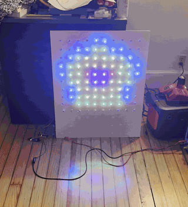
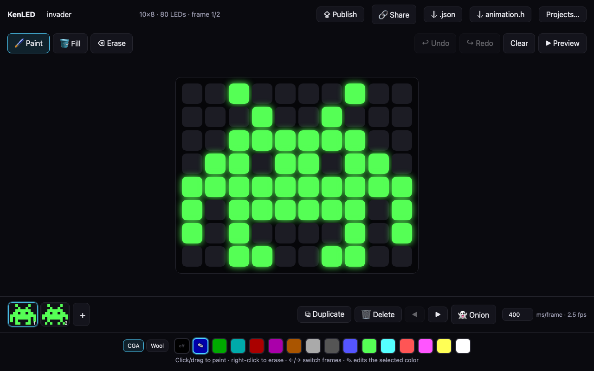
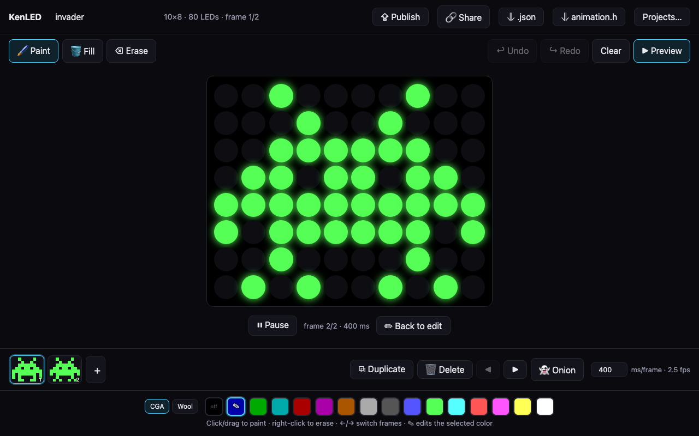
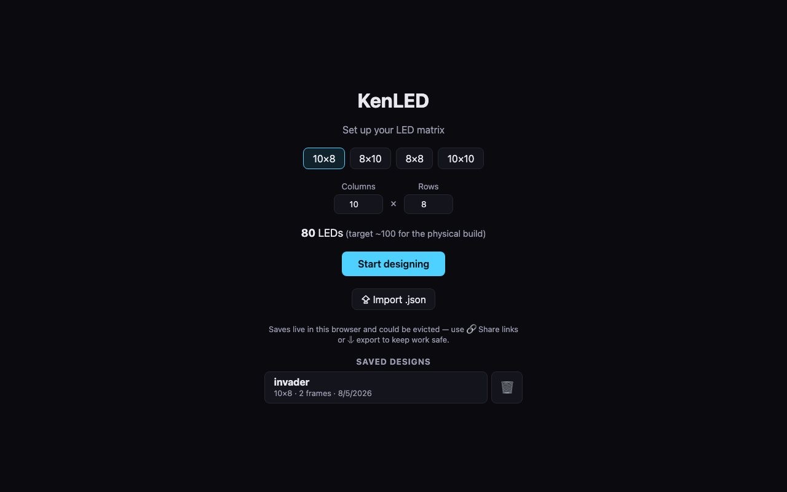

# KenLED

An art installation: a wall of **89 glass bricks**, each lit by an addressable
RGB LED, playing pixel animations designed in a browser and delivered to the
wall over the air.

Design an animation on the web, hit **Publish**, and within seconds every
device subscribed to the wall — the installation itself and a pocket-sized
monitor — is playing it.



*The 10×10 test rig: 100 WS2811 bullet pixels in foam board, driven by the
production firmware, playing a generated self-playing snake game published
over Wi-Fi seconds earlier. The glass-brick wall replaces the foam board;
everything else ships as-is.*



## How it works

```
Designer's browser                 GitHub                       The wall
┌──────────────────┐  commit   ┌───────────────┐  poll ~60s  ┌──────────────────┐
│  KenLED designer │──────────▶│ wall branch:  │◀────────────│ ESP32-S3 +       │
│  (GitHub Pages)  │  via API  │ current.json  │             │ 89 WS2811 pixels │
│  [⇪ Publish]     │           └───────────────┘◀──────┐     └──────────────────┘
└──────────────────┘                                   │     ┌──────────────────┐
                                                       └─────│ LilyGo T-Dongle  │
                                                             │ (pocket mirror)  │
                                                             └──────────────────┘
```

- **The designer** is a static React app on GitHub Pages. Publishing commits
  the animation as `current.json` to this repo's `wall` branch through the
  GitHub API (a fine-grained token, held only in the designer's browser).
- **Devices** poll the branch-ref API (uncached; conditional 304s are free)
  and fetch content by immutable commit sha — updates land on the next poll,
  never stale-cached.
- **Playback never depends on the network.** Devices boot from a flash cache,
  fall back to a compiled-in animation, and just keep playing if Wi-Fi dies.
  Every published animation is also permanently recoverable from git history.

## The designer



- Configurable grid (default 10×8 — the brick wall), 16-color palette with
  **CGA** and **Minecraft wool** presets, every swatch editable
- Paint / fill / erase, drag-painting, click-to-toggle, undo/redo
- Frames: add, duplicate, delete, reorder, onion-skin ghosting (wraps around
  for seamless loops), adjustable frame rate
- Preview mode: glowing-dot simulation of the physical wall
- Autosave to the browser, multiple named projects
- **Share links** — the entire design compressed into a URL; a link is a
  backup, a save file, and a way to send designs around, no server involved
- Export as `.json` or as an `animation.h` C header for offline firmware
- **⇪ Publish** — one click to put it on the wall



## Firmware (`firmware/`)

| Sketch | Board | Role |
|---|---|---|
| `kenled-wall` | ESP32-S3-DevKitC-1 | Production controller: drives the WS2811 chain via FastLED + OTA animation updates |
| `kenled-mirror` | LilyGo T-Dongle-C5 | Pocket mirror: plays the published wall animation on its 0.96" LCD |
| `kenled` | any ESP32 | Minimal offline player for a compiled-in `animation.h` |

Compile-time update modes (both connected sketches): **poll** (live updates
every 60 s), **boot-fetch** (pull once at power-on, then radio off — the
production mode: power-cycle the wall to update it), and **offline** (no Wi-Fi
compiled in at all). See `firmware/README.md` for build flags, board settings,
and wiring.

## Hardware

- 89× WS2811 12 V bullet pixels (one per glass brick, ~20 cm spacing)
- ESP32-S3-DevKitC-1 controller
- 12 V 10 A PSU (pixels) + 12 V→5 V buck (controller) — one wall plug
- Full BOM, wiring notes, and build order in [PLAN.md](PLAN.md)

### Test rig status (verified)

The complete production stack runs on a bench rig today: two 50-pixel WS2811
strings (10 cm spacing) mounted through foam board as a 10×10 grid, bench
supply at 12 V, data driven directly from the S3's GPIO 4 at 3.3 V logic —
no level shifter needed so far. Verified end to end on this rig:

- Color order (RGB channel probe), pixel-walk sweep of all 100 positions,
  serpentine + `FLIP_Y` mapping for a chain wired bottom-row-first
- Publish → pixels latency under 10 s (bench builds poll every 10 s; GitHub's
  conditional-request rules make this effectively free)
- Generated animations: a self-playing pong, a waving flag, a beating heart,
  a radiating rainbow star, a self-playing snake — animations are plain JSON,
  so anything scriptable is publishable
- Offline-first behavior under real failures: oversized payloads and network
  loss leave the wall playing the last good animation

Remaining for the installation: mount the pixels behind the glass bricks
(drill vs. back-mount pending a glow test), switch the firmware to boot-fetch
mode, and enable PSRAM in the build to lift the animation size ceiling.

## Development

```sh
npm install
npm run dev            # designer app at localhost:5173
npm run build          # production build (deployed by GitHub Actions on push)

# firmware (see firmware/README.md for FQBNs and flags)
arduino-cli compile --fqbn esp32:esp32:esp32s3:CDCOnBoot=cdc,FlashSize=16M,PartitionScheme=huge_app firmware/kenled-wall
```

Animations are plain JSON — grid size, a 16-color palette, frames as arrays
of palette indices — the same format in the app, the share links, the publish
pipeline, and (transposed to C) the compiled-in fallback.
